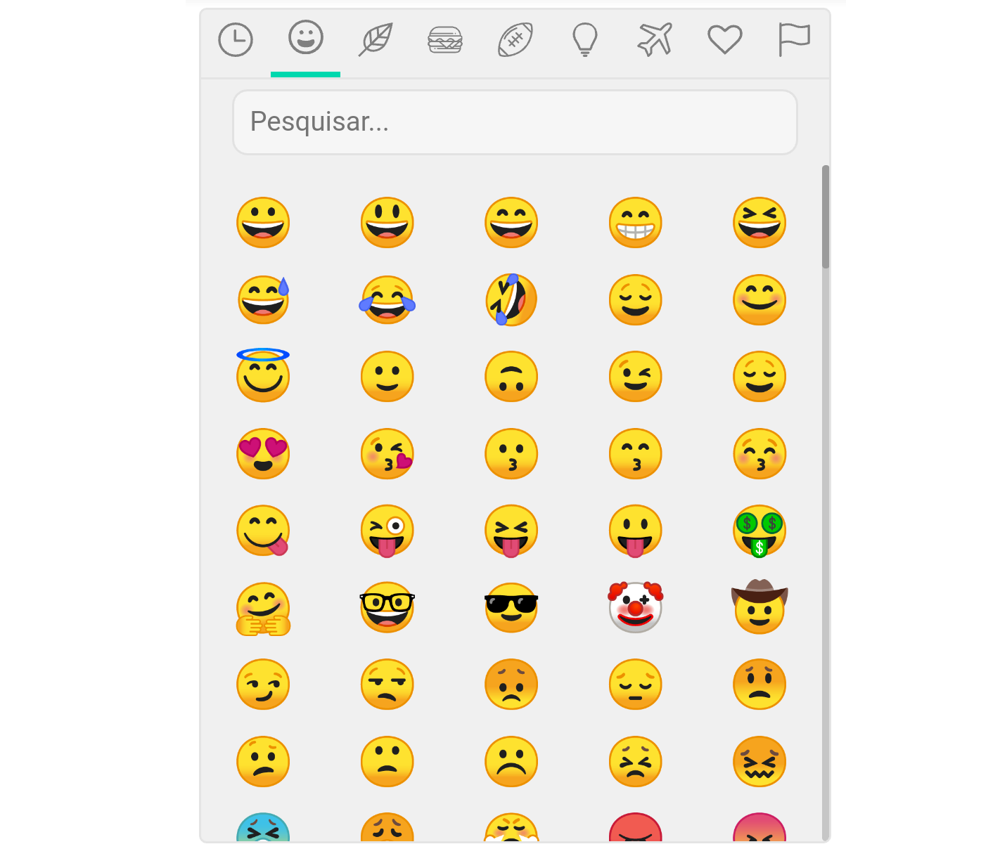
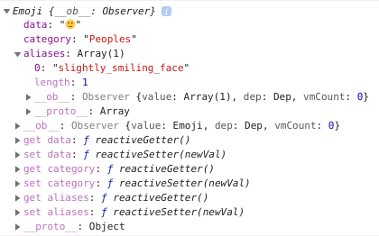
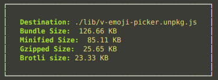

# V-Emoji-Picker
This simple package using Emojis Natives

[](https://www.npmjs.com/package/v-emoji-picker)
[](https://bundlephobia.com/result?p=v-emoji-picker@latest)
[](https://www.npmjs.com/package/v-emoji-picker)
[](https://vuejs.org/)
[](https://www.codefactor.io/repository/github/joaoeudes7/v-emoji-picker)


---
## Contents
 - [V-Emoji-Picker](#v-emoji-picker)
 - [Contents](#contents)
 - [Installation](#installation)
 - [Usage](#usage)
 - [Props](#props)
 - [Events](#events)
 - [Using custom Emojis](#using-custom-emojis)
 - [Using custom Categories](#using-custom-categories)
 - [Using SVG](#using-svg)
 - [Structure Emoji](#structure-emoji)
 - [Size](#size)
 - [License](#license)
----

# Installation
```bash
yarn add v-emoji-picker
```
# Usage
```vue
<template>
  <div id="app">
    <VEmojiPicker @select="selectEmoji" />
  </div>
</template>

<script>
import { VEmojiPicker } from 'v-emoji-picker';

export default {
  name: 'Demo',
  components: {
    VEmojiPicker
  },
  data: () => ({}),
  methods: {
    selectEmoji(emoji) {
      console.log(emoji)
    }
  }
}
</script>
```

or Global

```js
import Vue from "vue";
import App from "./App.vue";

import VEmojiPicker from 'v-emoji-picker';

Vue.config.productionTip = false;
Vue.use(VEmojiPicker);

new Vue({
  render: h => h(App)
}).$mount("#app");
```

## Props
```ts
{
  @Prop({ default: () => [] }) customEmojis!: IEmoji[];
  @Prop({ default: () => [] }) customCategories!: ICategory[];
  @Prop({ default: 15 }) limitFrequently!: number;
  @Prop({ default: 5 }) emojisByRow!: number;
  @Prop({ default: false }) continuousList!: boolean;
  @Prop({ default: 32 }) emojiSize!: number;
  @Prop({ default: true }) emojiWithBorder!: boolean;
  @Prop({ default: true }) showSearch!: boolean;
  @Prop({ default: true }) showCategories!: boolean;
  @Prop({ default: false }) dark!: boolean;
  @Prop({ default: "Peoples" }) initialCategory!: string;
  @Prop({ default: () => [] as ICategory[] }) exceptCategories!: ICategory[];
  @Prop({ default: () => [] as Emoji[] }) exceptEmojis!: IEmoji[];
  @Prop({}) i18n!: Object;
}
```

## Events
```js
{
  select: 'Emit event on Selected Emoji',
  changeCategory: 'Emit event on Change Category'
}
```

# Using custom Emojis
Array of items with `Interface IEmoji`

```js
interface IEmoji {
  data: string;
  category: string;
  aliases: string[];
}
```

set in Prop `customEmojis`

# Using custom Categories
Array of items with `Interface ICategory`

```js
interface ICategory {
  name: string;
  icon: string;
}
```

set in Prop `customCategories`

# Using SVG
Doc coming soon...

# i18n
Set in Prop `i18n` a object with structure of you custom translation:

```html
  <VEmojiPicker :i18n="i18n" />
```

```js
const i18n = {
  search: 'Pesquisar...',
  categories: {
    Activity: "Atividades",
    Flags: "Bandeiras",
    Foods: "Comida",
    Frequently: "Frequentes",
    Objects: "Objetos",
    Nature: "Natureza",
    Peoples: "Pessoas",
    Symbols: "Símbolos",
    Places: "Locais"
  }
}
```

or import from `locale/lang/${youLang}`

Obs: Default language is en-UK

# Structure Emoji


# Size


## License
[](https://app.fossa.io/projects/git%2Bgithub.com%2Fjoaoeudes7%2FV-Emoji-Picker?ref=badge_large)
